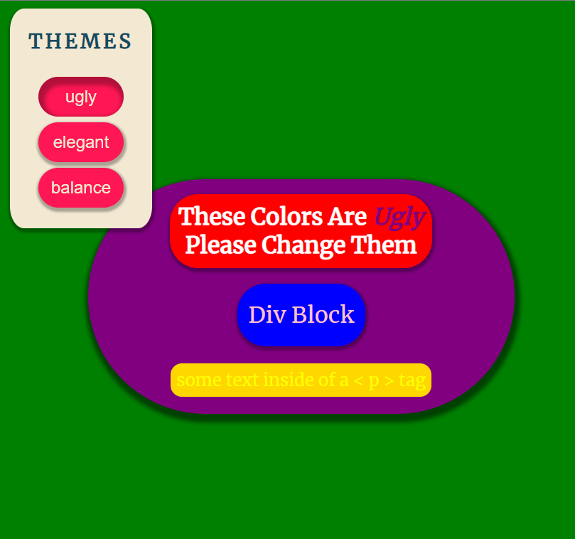
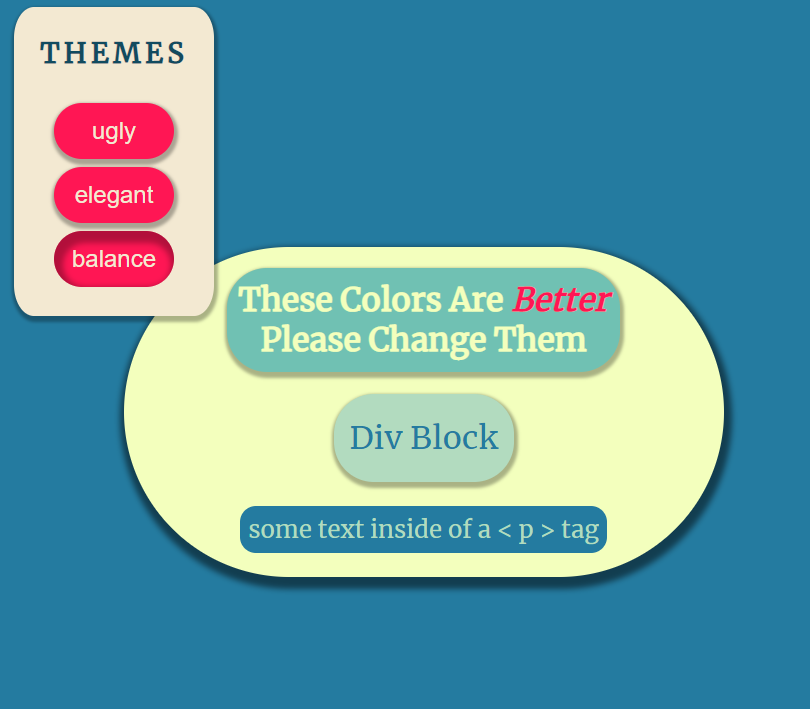

# THEME SWITCHER

In this project, we create a simple webpage and add a panel to switch between different color schemes. The colors are determined by the some CSS variables which we update whenever a button is clicked.

This project is made with:

* Vanilla Javascript
* HTML
* CSS

*Disclaimer:* ***NO FRAMEWORKS WERE HARMED IN THE DEVELOPOMENT OF THIS PROJECT***

## Demo

You can see the demo at [codepen](https://codepen.io/tlane311/pen/pobjVGg).

See below for some screen shots.

